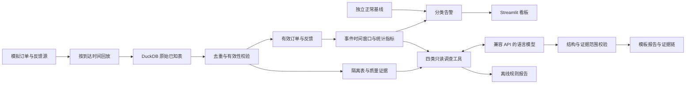

# 架构与生产迁移

页面若不渲染 Mermaid，可按从左至右的数据流阅读；完整链路也体现在代码阅读路线中。

## 当前实现

Python 按固定种子生成可重现事件。DuckDB 保留完整回放源，但只把已到达消息放入监控表；AI 只调用封装好的四个工具，不接收完整未来数据源，也不能自由执行 SQL 或代码。

每次回放从已知源重建快照，支持前进和后退。这是正确性优先的本地原型，不是增量流式计算。所有状态与筛选以当前会话为界，切换窗口后旧调查报告不作为当前结论展示。

AI 接入使用 Chat Completions 工具协议。模型最多请求四个工具 / 轮、六轮 / 次；最后一轮禁止继续工具调用。服务失败时保留已有工具轨迹并显示规则结果。完整证据携带时间范围、筛选通道、编号和 SHA-256 摘要。摘要用于检查内容是否改变，不是数字签名或可信来源认证。

报告使用受控结论代码与下一步检查代码，后端验证其与证据相容。事实句的数字由工具结果渲染。这降低数值幻觉风险，也意味着模型不能自由编写未建模的根因分析。通过校验不等于因果关系已证明。

## 如何迁移到生产

| 原型 | 生产方向 | 新增问题 |
| --- | --- | --- |
| 内存事件回放 | Kafka 接入订单与反馈主题 | 分区键、消费位点、消息重放、Schema 演进 |
| 每次完整快照重建 | Flink 按订单键保存状态、事件时间窗口 | Watermark、允许迟到、侧输出、状态 TTL、Checkpoint |
| DuckDB 单进程 SQL | ClickHouse 分析查询与明细存储 | 写入批次、历史修订、重复版本、分区和查询成本 |
| 本地规则与配置 | 分级告警、变更审批与规则版本 | 幂等事件、告警合并、负责人和恢复闭环 |
| 本地模型调用 | 有权限与审计的 AI 服务 | 数据最小化、超时、费用、版本评估、可观测性 |

特别注意：Flink 内部 exactly-once 不自动保证外部数据库和业务端到端 exactly-once；需结合源、状态和接收端的事务或幂等语义。

超出允许迟到范围的数据应进入补偿流程，不能静默丢弃。更新历史窗口时应保留版本和修订原因，才能回答“当时知道什么”与“现在知道什么”。

## 当前不支持

真实行情接入、真实交易状态机、撤单与改单、金额加权成交率、持仓风险、分布式容错、权限隔离、生产级告警发送与大规模性能保障。这里的通道是模拟类别，不映射真实交易机构。
